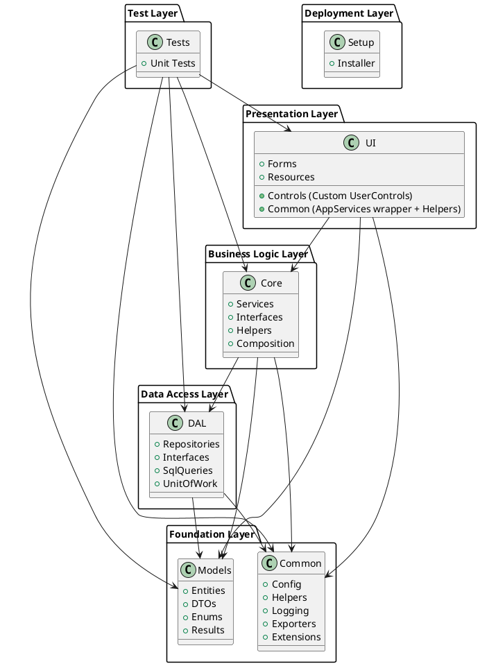

# Tài Liệu Hướng Dẫn Vẽ Sơ Đồ Packaging Diagram

## Mục Đích
Tài liệu này hướng dẫn cách vẽ sơ đồ packaging diagram cho ứng dụng **EcoStationManagerApplication** dựa trên kiến trúc phân lớp (Layered Architecture).

## Tổng Quan Kiến Trúc

Ứng dụng được tổ chức theo mô hình **Layered Architecture** với các lớp sau (từ dưới lên trên):

1. **Models Layer** - Lớp mô hình dữ liệu
2. **Common Layer** - Lớp tiện ích chung
3. **DAL Layer** - Lớp truy cập dữ liệu
4. **Core Layer** - Lớp nghiệp vụ
5. **UI Layer** - Lớp giao diện người dùng
6. **Tests Layer** - Lớp kiểm thử
7. **Setup Layer** - Lớp đóng gói cài đặt

## Cấu Trúc Các Package (Project)

### 1. EcoStationManagerApplication.Models
- **Vị trí**: Lớp nền tảng (Foundation Layer)
- **Mục đích**: Định nghĩa các entity, DTO, enum, và kết quả trả về
- **Dependencies**: Không có dependencies đến các project khác trong solution
- **Thành phần chính**:
  - `Entities/` - Các entity: Customer, Inventory, Order, Product, Station, User, LogisticEntities
  - `DTOs/` - Data Transfer Objects
  - `Enums/` - Các enum định nghĩa
  - `Results/` - Các class kết quả: Result, PagedResult, OperationStatus
  - `ViewModels/` - View models (nếu có)

### 2. EcoStationManagerApplication.Common
- **Vị trí**: Lớp nền tảng (Foundation Layer)
- **Mục đích**: Cung cấp các tiện ích, helper, config, và exporter chung
- **Dependencies**: Không có dependencies đến các project khác trong solution
- **Thành phần chính**:
  - `Config/` - ConfigManager, ConnectionHelper, Config
  - `Helpers/` - SecurityHelper, UserContextHelper, JsonHelper
  - `Logging/` - LogHelper
  - `Exporters/` - ExcelExporter, PdfExporter, IExcelExporter, IPdfExporter
  - `Extensions/` - Các extension methods
  - `Utilities/` - Các tiện ích khác
  - `Constants/` - Các hằng số

### 3. EcoStationManagerApplication.DAL (Data Access Layer)
- **Vị trí**: Lớp truy cập dữ liệu
- **Mục đích**: Xử lý tất cả các thao tác với database
- **Dependencies**: 
  - `EcoStationManagerApplication.Models`
  - `EcoStationManagerApplication.Common`
- **Thành phần chính**:
  - `Repositories/` - Các repository: BaseRepository, CustomerRepository, OrderRepository, ProductRepository, UserRepository, StationRepository, InventoryRepository, PackagingRepository, PackagingInventoryRepository, PackagingTransactionRepository, StockInRepository, StockOutRepository, DeliveryRepository, WorkShiftRepository, OrderDetailRepository, ReportRepository, SupplierRepository
  - `Interfaces/` - Các interface cho repositories
  - `SqlQueries/` - Các class chứa SQL queries
  - `UnitOfWork/` - UnitOfWork pattern implementation
  - `Database/` - DatabaseHelper

### 4. EcoStationManagerApplication.Core (Business Logic Layer)
- **Vị trí**: Lớp nghiệp vụ
- **Mục đích**: Chứa logic nghiệp vụ và các service
- **Dependencies**:
  - `EcoStationManagerApplication.Models`
  - `EcoStationManagerApplication.Common`
  - `EcoStationManagerApplication.DAL`
- **Thành phần chính**:
  - `Services/` - Các service: CustomerService, OrderService, ProductService, UserService, StationService, InventoryService, PackagingInventoryService, PackagingTransactionService, StockInService, StockOutService, DeliveryService, WorkShiftService, OrderDetailService, ExportService, ReportService
  - `Interfaces/` - Các interface cho services
  - `Helpers/` - BusinessRules, MappingHelper, ValidationHelper
  - `Composition/` - ServiceRegistry (Dependency Injection)
  - `Exceptions/` - Custom exceptions
  - `Managers/` - Business managers (nếu có)

### 5. EcoStationManagerApplication.UI (Presentation Layer)
- **Vị trí**: Lớp giao diện
- **Mục đích**: Giao diện người dùng Windows Forms
- **Dependencies**:
  - `EcoStationManagerApplication.Models`
  - `EcoStationManagerApplication.Common`
  - `EcoStationManagerApplication.Core`
- **Thành phần chính**:
  - `Forms/` - Các form Windows Forms (MainForm, WorkShiftForm, và các form khác)
  - `Controls/` - Custom Controls (UserControls): DashboardControl, InventoryControl, OrdersControl, ProductsControl, CustomersControl, ReportsControl, StaffControl, PackagingControl, StockInManagementControl, StockOutManagementControl, SettingsControl, SystemSettingsControl, và các controls khác
  - `Common/` - Các class hỗ trợ UI:
    - `AppServices.cs` - Service wrapper (static class cung cấp access đến Core services thông qua ServiceRegistry)
    - `FormHelper.cs` - Helper cho forms
    - `UIHelper.cs` - Helper cho UI
    - `Helper.cs` - Helper chung
    - `AppColors.cs` - Quản lý màu sắc
    - `ApplicationContext.cs` - Application context
    - `EmailNotificationHelper.cs` - Helper cho email
    - `FastReportHelper.cs` - Helper cho báo cáo
    - `ResponsiveLayoutHelper.cs` - Helper cho responsive layout
    - `RolePermissionHelper.cs` - Helper cho phân quyền
    - `ThemManager.cs` - Quản lý theme
    - `TogglerSidebar.cs` - Toggle sidebar
    - `IRefreshableControl.cs` - Interface cho controls có thể refresh
  - `Resources/` - Hình ảnh, icons (PNG, JPG, SVG)
  - `Styles/` - Styles cho UI
  - `Program.cs` - Entry point

**Lưu ý về cấu trúc UI Package:**
- **Không có "UI Service" riêng**: UI không có service layer riêng. Thay vào đó, UI sử dụng `AppServices` (trong `Common/`) như một wrapper để truy cập các services từ Core layer thông qua `ServiceRegistry`.
- **"Custom Service" = Custom Controls**: Các UserControl trong thư mục `Controls/` có thể được coi là "custom services" cho UI, nhưng chúng là các controls, không phải services theo nghĩa business logic.
- **Forms**: Đúng, thư mục `Forms/` chứa các Windows Forms.

**Kiến trúc đúng:**
```
UI Package
├── Forms/          (Windows Forms - Presentation)
├── Controls/       (Custom UserControls - Presentation Components)
├── Common/         (Helpers + AppServices wrapper)
│   ├── AppServices (Service wrapper, không phải service thực sự)
│   └── Helpers     (UI helpers)
└── Resources/      (Assets)
```

### 6. EcoStationManagerApplication.Tests
- **Vị trí**: Lớp kiểm thử
- **Mục đích**: Unit tests và integration tests
- **Dependencies**: Tất cả các project trên (Models, Common, DAL, Core, UI)
- **Thành phần chính**:
  - `UnitTest1.cs` - Các test cases

### 7. Setup
- **Vị trí**: Lớp đóng gói
- **Mục đích**: Tạo installer cho ứng dụng
- **Dependencies**: Có thể phụ thuộc vào các project khác để đóng gói

## Hướng Dẫn Vẽ Sơ Đồ Packaging Diagram

### Bước 1: Xác Định Các Package

Vẽ các package (hình chữ nhật với góc trên bên trái có tab nhỏ) cho 7 project chính:

```
┌─────────────────────────────────────┐
│ EcoStationManagerApplication.Models │
└─────────────────────────────────────┘

┌─────────────────────────────────────┐
│ EcoStationManagerApplication.Common │
└─────────────────────────────────────┘

┌─────────────────────────────────────┐
│ EcoStationManagerApplication.DAL    │
└─────────────────────────────────────┘

┌─────────────────────────────────────┐
│ EcoStationManagerApplication.Core   │
└─────────────────────────────────────┘

┌─────────────────────────────────────┐
│ EcoStationManagerApplication.UI     │
└─────────────────────────────────────┘

┌─────────────────────────────────────┐
│ EcoStationManagerApplication.Tests  │
└─────────────────────────────────────┘

┌─────────────────────────────────────┐
│ Setup                                │
└─────────────────────────────────────┘
```

### Bước 2: Vẽ Các Dependencies (Mũi Tên)

Sử dụng mũi tên để chỉ ra dependencies giữa các package. Mũi tên chỉ từ package phụ thuộc đến package được phụ thuộc.

#### Dependencies Chi Tiết:

1. **DAL** phụ thuộc vào:
   - Models (mũi tên từ DAL → Models)
   - Common (mũi tên từ DAL → Common)

2. **Core** phụ thuộc vào:
   - Models (mũi tên từ Core → Models)
   - Common (mũi tên từ Core → Common)
   - DAL (mũi tên từ Core → DAL)

3. **UI** phụ thuộc vào:
   - Models (mũi tên từ UI → Models)
   - Common (mũi tên từ UI → Common)
   - Core (mũi tên từ UI → Core)

4. **Tests** phụ thuộc vào:
   - Models (mũi tên từ Tests → Models)
   - Common (mũi tên từ Tests → Common)
   - DAL (mũi tên từ Tests → DAL)
   - Core (mũi tên từ Tests → Core)
   - UI (mũi tên từ Tests → UI)

5. **Setup** có thể phụ thuộc vào các project khác (tùy vào implementation)

### Bước 3: Sơ Đồ Hoàn Chỉnh (Text Format)

```
                    ┌─────────────────────────────────────┐
                    │ EcoStationManagerApplication.Models  │
                    │ (Foundation Layer)                   │
                    └─────────────────────────────────────┘
                                    ▲
                                    │
                    ┌───────────────┴───────────────┐
                    │                               │
    ┌───────────────┴───────────────┐   ┌──────────┴──────────────────────┐
    │ EcoStationManagerApplication   │   │ EcoStationManagerApplication   │
    │ Common                         │   │ DAL                            │
    │ (Foundation Layer)             │   │ (Data Access Layer)            │
    └────────────────────────────────┘   └──────────┬──────────────────────┘
                    ▲                               │
                    │                               │
                    │                               │
    ┌───────────────┴───────────────────────────────┴───────────────┐
    │ EcoStationManagerApplication.Core                             │
    │ (Business Logic Layer)                                        │
    └───────────────┬───────────────────────────────────────────────┘
                    │
                    │
    ┌───────────────┴───────────────────────────────────────────────┐
    │ EcoStationManagerApplication.UI                               │
    │ (Presentation Layer)                                          │
    └───────────────┬───────────────────────────────────────────────┘
                    │
                    │
    ┌───────────────┴───────────────────────────────────────────────┐
    │ EcoStationManagerApplication.Tests                            │
    │ (Test Layer)                                                  │
    └────────────────────────────────────────────────────────────────┘

    ┌────────────────────────────────────────────────────────────────┐
    │ Setup                                                          │
    │ (Deployment Layer)                                             │
    └────────────────────────────────────────────────────────────────┘
```

### Bước 4: Sơ Đồ UML (PlantUML Format)

Bạn có thể sử dụng PlantUML để vẽ sơ đồ tự động:



### Bước 5: Sơ Đồ Với Chi Tiết Thành Phần

Để vẽ sơ đồ chi tiết hơn, bạn có thể thêm các thành phần con vào mỗi package:

```
┌─────────────────────────────────────────────────────────────┐
│ EcoStationManagerApplication.Models                         │
│ ┌──────────┐ ┌──────────┐ ┌──────────┐ ┌──────────┐        │
│ │Entities  │ │  DTOs    │ │  Enums   │ │ Results  │        │
│ └──────────┘ └──────────┘ └──────────┘ └──────────┘        │
└─────────────────────────────────────────────────────────────┘

┌─────────────────────────────────────────────────────────────┐
│ EcoStationManagerApplication.Common                         │
│ ┌──────────┐ ┌──────────┐ ┌──────────┐ ┌──────────┐        │
│ │  Config  │ │ Helpers  │ │ Logging  │ │Exporters │        │
│ └──────────┘ └──────────┘ └──────────┘ └──────────┘        │
└─────────────────────────────────────────────────────────────┘

┌─────────────────────────────────────────────────────────────┐
│ EcoStationManagerApplication.DAL                            │
│ ┌──────────────┐ ┌──────────────┐ ┌──────────────┐         │
│ │ Repositories │ │  Interfaces  │ │ SqlQueries   │         │
│ └──────────────┘ └──────────────┘ └──────────────┘         │
│ ┌──────────────┐                                            │
│ │ UnitOfWork   │                                            │
│ └──────────────┘                                            │
└─────────────────────────────────────────────────────────────┘

┌─────────────────────────────────────────────────────────────┐
│ EcoStationManagerApplication.Core                           │
│ ┌──────────┐ ┌──────────┐ ┌──────────┐ ┌──────────┐        │
│ │ Services │ │Interfaces│ │ Helpers  │ │Composition│       │
│ └──────────┘ └──────────┘ └──────────┘ └──────────┘        │
└─────────────────────────────────────────────────────────────┘

┌─────────────────────────────────────────────────────────────┐
│ EcoStationManagerApplication.UI                             │
│ ┌──────────┐ ┌──────────────┐ ┌──────────┐ ┌──────────┐    │
│ │  Forms   │ │   Controls   │ │  Common  │ │Resources │    │
│ │          │ │ (Custom      │ │(Helpers+ │ │          │    │
│ │          │ │  UserControls)│ │AppServices││          │    │
│ └──────────┘ └──────────────┘ └──────────┘ └──────────┘    │
└─────────────────────────────────────────────────────────────┘
```

## Nguyên Tắc Kiến Trúc

### 1. Dependency Direction (Hướng Phụ Thuộc)
- Các lớp trên phụ thuộc vào các lớp dưới
- Không có dependency ngược (lower layer không phụ thuộc upper layer)
- Models và Common là foundation, không phụ thuộc project nào khác

### 2. Separation of Concerns (Tách Biệt Mối Quan Tâm)
- **Models**: Chỉ chứa data structures
- **Common**: Chỉ chứa utilities và helpers
- **DAL**: Chỉ xử lý database operations
- **Core**: Chứa business logic
- **UI**: Chỉ xử lý presentation

### 3. Dependency Inversion
- Core sử dụng interfaces từ DAL (không phụ thuộc trực tiếp vào implementation)
- UI sử dụng services qua interfaces từ Core

## Công Cụ Vẽ Sơ Đồ

### 1. PlantUML
- **Website**: https://plantuml.com/
- **Ưu điểm**: Text-based, dễ version control, tự động layout
- **Cách dùng**: Copy code PlantUML ở trên vào editor

### 2. Draw.io / diagrams.net
- **Website**: https://app.diagrams.net/
- **Ưu điểm**: Free, online, nhiều template
- **Cách dùng**: Vẽ thủ công theo hướng dẫn

### 3. Visual Studio
- **Cách dùng**: Architecture → New Diagram → Layer Diagram
- **Ưu điểm**: Tích hợp với code, có thể validate dependencies

### 4. Lucidchart
- **Website**: https://www.lucidchart.com/
- **Ưu điểm**: Professional, collaboration features

## Ví Dụ Sơ Đồ Chi Tiết Với Các Class Chính

### Models Package
```
Models
├── Entities
│   ├── Customer
│   ├── Order
│   ├── Product
│   ├── User
│   ├── Station
│   ├── Inventory
│   └── LogisticEntities
├── DTOs
│   ├── CustomerDTO
│   ├── OrderDTO
│   ├── ProductDTO
│   └── ...
├── Enums
│   └── Enums
└── Results
    ├── Result
    ├── PagedResult
    └── OperationStatus
```

### DAL Package
```
DAL
├── Repositories
│   ├── BaseRepository
│   ├── CustomerRepository
│   ├── OrderRepository
│   ├── ProductRepository
│   └── ...
├── Interfaces
│   ├── ICustomerRepository
│   ├── IOrderRepository
│   └── ...
├── SqlQueries
│   ├── CustomerQueries
│   ├── OrderQueries
│   └── ...
└── UnitOfWork
    ├── UnitOfWork
    └── UnitOfWorkFactory
```

### Core Package
```
Core
├── Services
│   ├── CustomerService
│   ├── OrderService
│   ├── ProductService
│   └── ...
├── Interfaces
│   ├── ICustomerService
│   ├── IOrderService
│   └── ...
├── Helpers
│   ├── BusinessRules
│   ├── MappingHelper
│   └── ValidationHelper
└── Composition
    └── ServiceRegistry
```

### UI Package
```
UI
├── Forms
│   ├── MainForm
│   ├── WorkShiftForm
│   └── ... (các form khác)
├── Controls (Custom UserControls)
│   ├── DashboardControl
│   ├── InventoryControl
│   ├── OrdersControl
│   ├── ProductsControl
│   ├── CustomersControl
│   ├── ReportsControl
│   ├── StaffControl
│   ├── PackagingControl
│   ├── StockInManagementControl
│   ├── StockOutManagementControl
│   ├── SettingsControl
│   ├── SystemSettingsControl
│   └── ... (các controls khác)
├── Common
│   ├── AppServices (Service wrapper - truy cập Core services)
│   ├── FormHelper
│   ├── UIHelper
│   ├── Helper
│   ├── AppColors
│   ├── ApplicationContext
│   ├── EmailNotificationHelper
│   ├── FastReportHelper
│   ├── ResponsiveLayoutHelper
│   ├── RolePermissionHelper
│   ├── ThemManager
│   ├── TogglerSidebar
│   └── IRefreshableControl
└── Resources
    └── Images, Icons (PNG, JPG, SVG)
```

**Giải thích về cấu trúc UI:**
- **Forms**: Các Windows Forms chính của ứng dụng
- **Controls**: Các UserControl tùy chỉnh, mỗi control đại diện cho một chức năng/module
- **Common/AppServices**: Không phải service layer riêng, mà là wrapper class để UI truy cập các services từ Core layer. Đây là cách UI giao tiếp với business logic layer.
- **Common/Helpers**: Các helper classes hỗ trợ cho UI operations

## Lưu Ý Khi Vẽ

1. **Màu sắc**: Có thể dùng màu khác nhau cho mỗi layer để dễ phân biệt
2. **Kích thước**: Package quan trọng hơn có thể vẽ lớn hơn
3. **Vị trí**: Đặt các package theo thứ tự từ dưới lên trên (Models ở dưới, UI ở trên)
4. **Mũi tên**: Luôn chỉ từ package phụ thuộc đến package được phụ thuộc
5. **Legend**: Thêm chú thích giải thích các ký hiệu và màu sắc

## Kết Luận

Sơ đồ packaging diagram giúp:
- Hiểu rõ cấu trúc và dependencies của dự án
- Phát hiện circular dependencies
- Đảm bảo tuân thủ kiến trúc phân lớp
- Hỗ trợ onboarding cho developers mới
- Tài liệu hóa kiến trúc hệ thống

Sử dụng tài liệu này làm hướng dẫn để vẽ sơ đồ packaging diagram cho dự án EcoStationManagerApplication.

