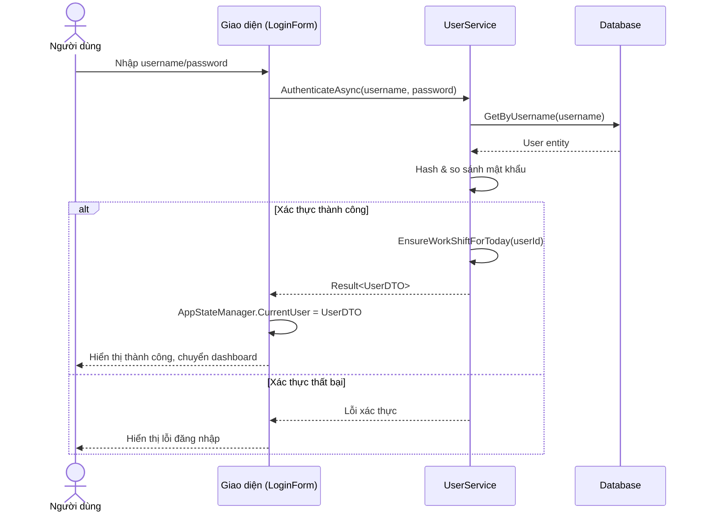
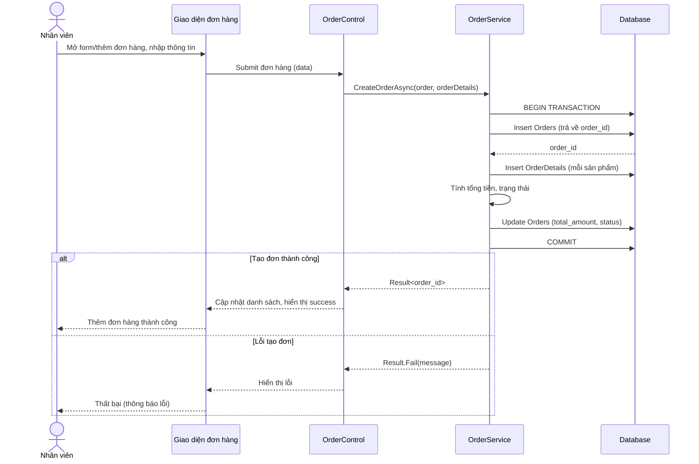
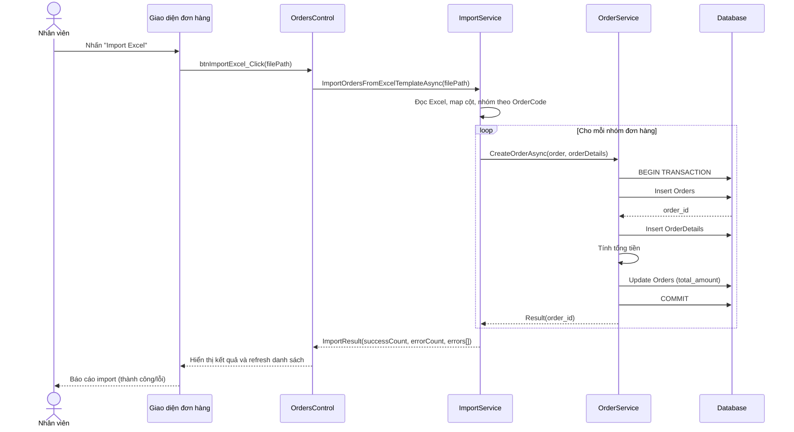
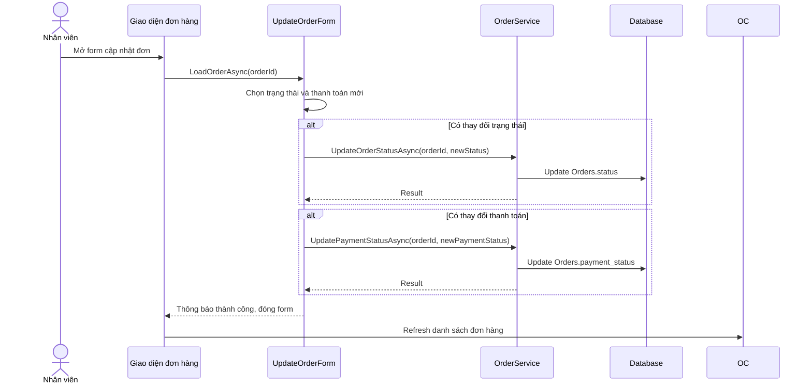
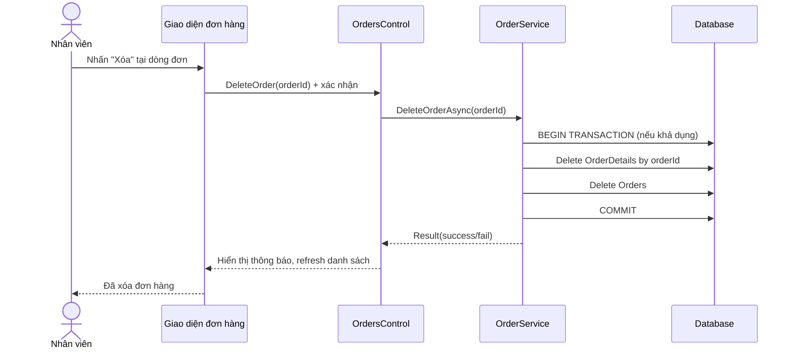
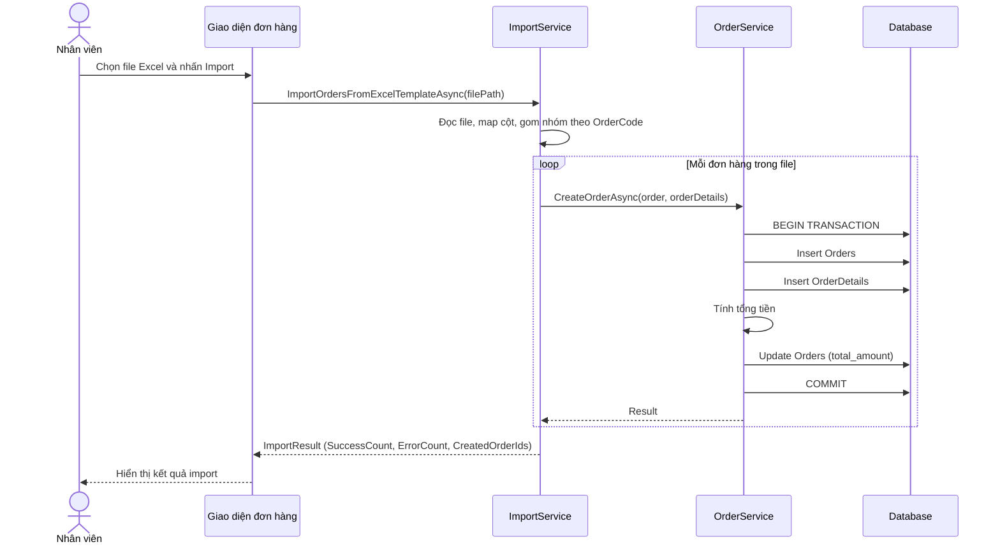
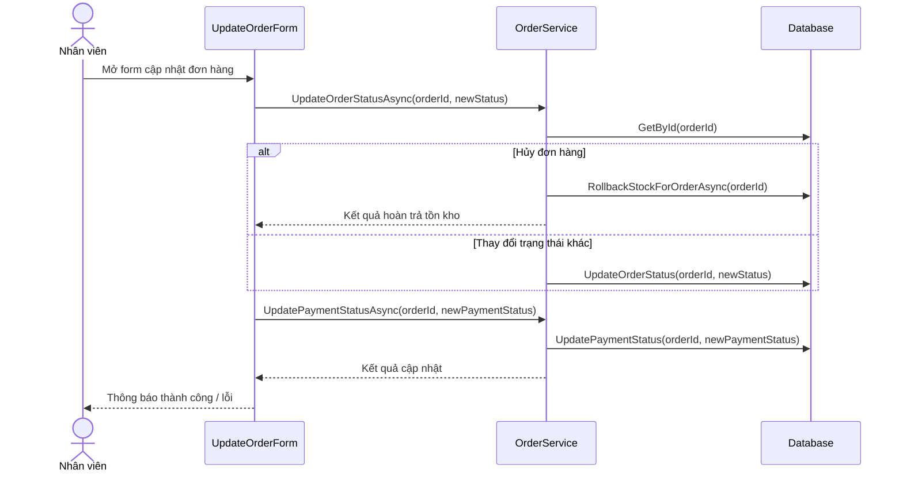
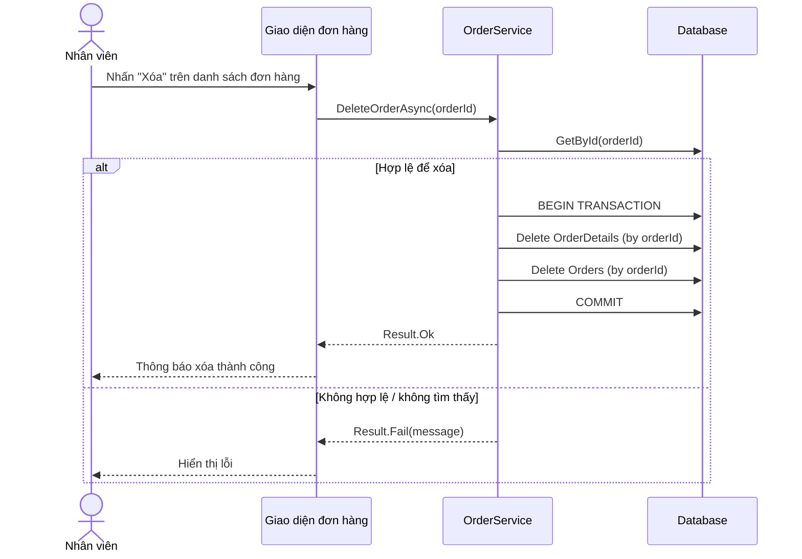

# Sơ đồ Sequence (Mermaid)

Tài liệu này tổng hợp các sơ đồ sequence chính của hệ thống. Dán các khối mã Mermaid vào trình xem Markdown hỗ trợ Mermaid để hiển thị sơ đồ.

## Đăng nhập người dùng

Tham chiếu mã: `EcoStationManagerApplication.Core/Services/UserService.cs:27`, `EcoStationManagerApplication.UI/Forms/LoginForm.cs:213`, `EcoStationManagerApplication.DAL/Repositories/UserRepository.cs:22`.

## Thêm đơn hàng

Tham chiếu mã: `EcoStationManagerApplication.Core/Services/OrderService.cs:274`, `EcoStationManagerApplication.DAL/UnitOfWork/UnitOfWork .cs:48`, `EcoStationManagerApplication.UI/Controls/OrdersControl.cs:603`.

## Import đơn hàng từ Excel

Tham chiếu mã: `EcoStationManagerApplication.UI/Controls/OrdersControl.cs:524`, `EcoStationManagerApplication.Core/Services/ImportService.cs:70`, `EcoStationManagerApplication.Core/Services/OrderService.cs:209`.

## Cập nhật trạng thái/thanh toán đơn hàng

Tham chiếu mã: `EcoStationManagerApplication.UI/Forms/UpdateOrderForm.cs:105`, `EcoStationManagerApplication.Core/Services/OrderService.cs:314`, `EcoStationManagerApplication.Core/Services/OrderService.cs:366`, `EcoStationManagerApplication.UI/Controls/OrdersControl.cs:729`.

## Xóa đơn hàng

Tham chiếu mã: `EcoStationManagerApplication.UI/Controls/OrdersControl.cs:743`, `EcoStationManagerApplication.Core/Services/OrderService.cs:609`.

## Import đơn hàng từ Excel

Tham chiếu mã: `EcoStationManagerApplication.UI/Controls/OrdersControl.cs:524`, `EcoStationManagerApplication.Core/Services/ImportService.cs:216`, `EcoStationManagerApplication.Core/Services/ImportService.cs:70`, `EcoStationManagerApplication.Core/Services/OrderService.cs:209`.

## Cập nhật đơn hàng (trạng thái & thanh toán)

Tham chiếu mã: `EcoStationManagerApplication.UI/Forms/UpdateOrderForm.cs:105`, `EcoStationManagerApplication.Core/Services/OrderService.cs:314`, `EcoStationManagerApplication.Core/Services/OrderService.cs:366`, `EcoStationManagerApplication.Core/Services/OrderService.cs:593`.

## Xóa đơn hàng

Tham chiếu mã: `EcoStationManagerApplication.UI/Controls/OrdersControl.cs:743`, `EcoStationManagerApplication.Core/Services/OrderService.cs:609`, `EcoStationManagerApplication.Core/Services/OrderService.cs:642`.
